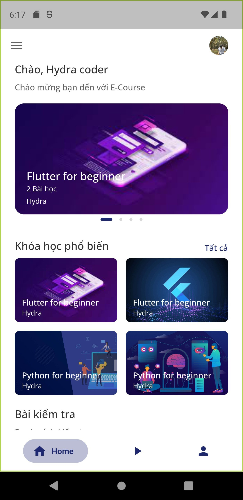
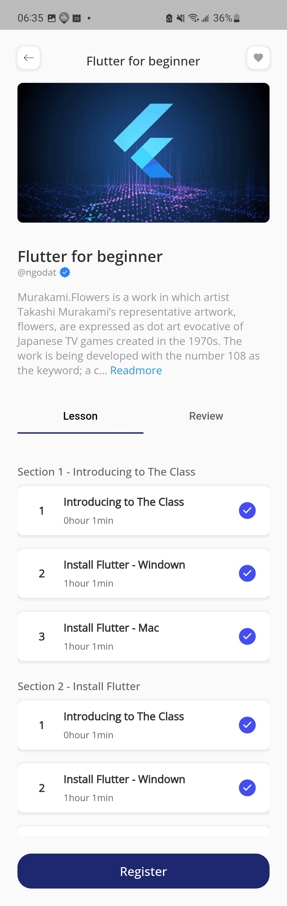
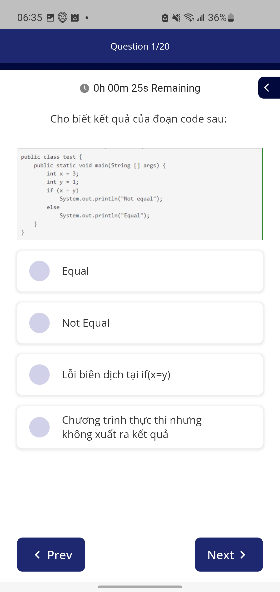

# E-Course

Access your ERPNext desk or any other Frappe desk anytime from your smartphone.

<kbd></kbd>
<kbd></kbd>
<kbd></kbd>

## Features:
1) Login, signup, and forgot password functionality.
2) Home page: View all courses, search for courses.
3) Courses: Comments, reviews, and watch videos.
4) Quizzes: Multiple-choice questions, view results, and check answers.
5) Settings: User account settings, multiple languages (Vietnamese and English), favorite courses, about us, contact us, and logout.

## Tech:
1) Firebase: Authentication, Storage, Realtime Database, Firestore Database
2) Cloud Dinary

## Development
0) To run this Project first you need to [Setup Flutter](https://flutter.dev/docs/get-started/install)

1) Install packages<br/>
```sh
flutter pub get
```
2) Run the Project<br/>
```sh
flutter run
```

### Architecture

This Project roughly follows MVVM Architecture where each screen has seperate file and each stateful screen is contained in a folder with 2 files 

1) View file (layout logic) 
2) View Model File (data processing and state management). 

This Project uses [provider](https://pub.dev/packages/provider) for State Management. 
[hive](https://pub.dev/packages/hive), [shared_preferences](https://pub.dev/packages/shared_preferences) for storage. 
[dio](https://pub.dev/packages/dio) for making network requests.
